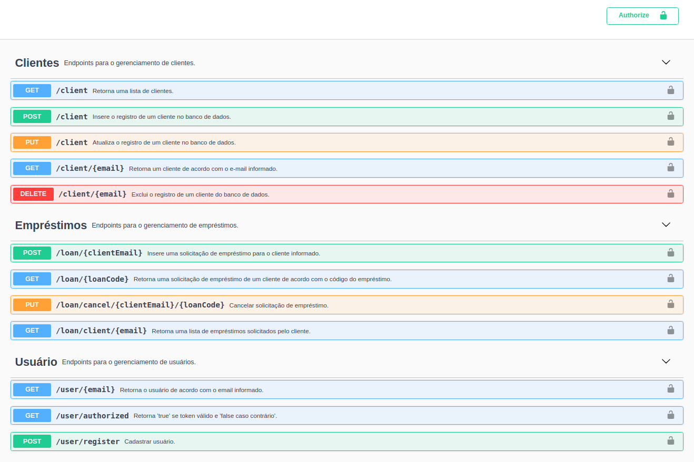

# API REST para solicitação de empréstimos


Esta API foi desenvolvida para cadastrar solicitação de empréstimos, cadastrar clientes e pesquisar as solicitações dos mesmos.

Pré-requisitos para executar o projeto:
- Java 11 (foi utilizado o openjdk-11);
- Maven 3.6.3;
- Spring Boot 2.5.6;
- IDE de sua escolha (utilizei o [STS](https://spring.io/tools)).

O banco de dados utilizado é o H2 (banco de dados relacional escrito em Java). utilizei o H2 para não ter que instalar um software gerenciador de banco de dados e outras dependências, mas o projeto pode ser adaptado para outros bancos, sem necessidade de alterar código (apenas configurações do banco a ser utilizado).

### :computer: Rodar a aplicação
---

Para executar o projeto no terminal, digite o seguinte comando:

```shell script
$ mvn spring-boot:run
```

Após executar o comando acima, o seguinte endereço da API estará disponível:

```
http://localhost:8081/
```

> **Obs.**:
> 
> Login de usuário no endpoint: POST `http://localhost:8081/login`.
> 
> Exemplo para o conteúdo no corpo da requisição: { "email": "admin@email.com", "password": "123456" }
> 
> Após o login será retornado um token **JWT**, que é utilizado na aplicação para validar o acesso do usuário.
>

Foi utilizado o Swagger 2 para Spring REST web service, usando a biblioteca [Springfox](https://github.com/springfox/springfox).
O Springfox irá retornar um JSON com as informações da documentação da API e para verificar se está funcionando, acesse: 

```
http://localhost:8081/v2/api-docs
```

Mas, para melhor visualização das informações, usamos o Swagger UI, no endereço:

```
http://localhost:8081/swagger-ui/
```

<kbd>
  
</kbd>

<br>
<br>

Fluxo da API:
```
Controller > Service > Repository > Entity
```
